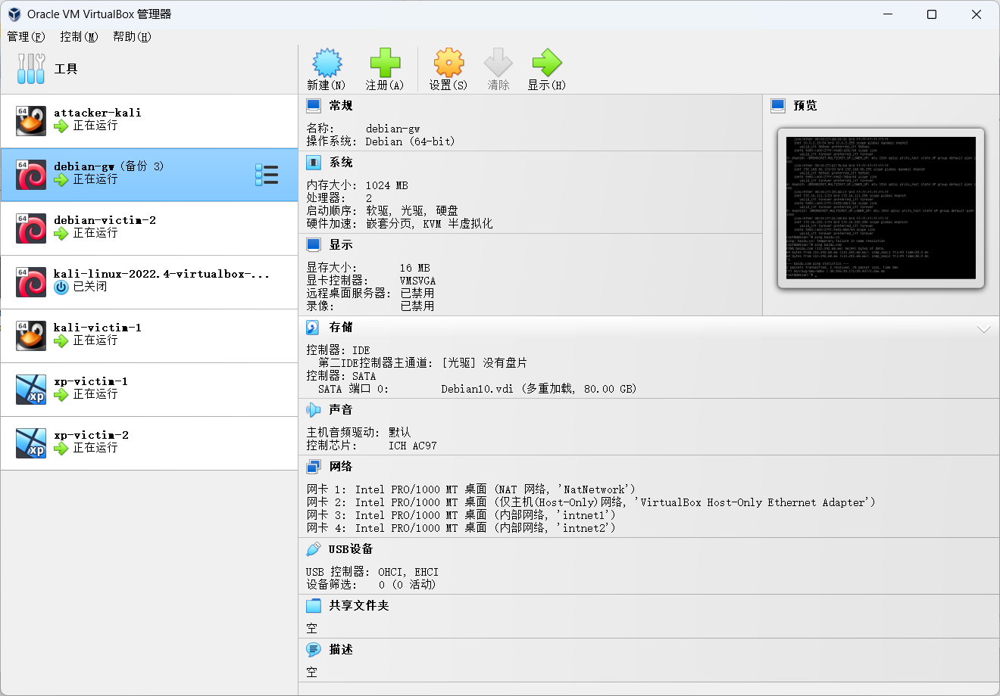

## 基于 VirtualBox 的网络攻防基础环境搭建

### 实验目的

- 掌握 VirtualBox 虚拟机的安装与使用；
- 掌握 VirtualBox 的虚拟网络类型和按需配置；
- 掌握 VirtualBox 的虚拟硬盘多重加载

### 实验环境

- VirtualBox 虚拟机
- 攻击者主机（Attacker）：Kali
- 网关（Gateway, GW）：Debian
- 靶机（Victim）：Debian / xp-sp3 / Kali

### 实验要求

* 虚拟硬盘配置成多重加载

* 搭载满足如下拓扑图所示的虚拟机网络拓扑

  

* 完成以下网络的连通性测试：

  * 靶机可以直接访问攻击者主机
  * 攻击者主机无法直接访问靶机
  * 网关可以直接访问攻击者主机和靶机
  * 靶机的所有对外上下行流量必须经过网关
  * 所有节点均可以访问互联网

### 实验过程

#### 虚拟硬盘配置成多重加载

点击virtualbox

管理 ->工具 ->虚拟介质管理 


#### 搭载满足如拓扑图所示的虚拟机网络拓扑

先配置好ssh登录

```
# To enable SSH login for a root user on Debian Linux system you need to first configure SSH server. Open /etc/ssh/sshd_config
vim /etc/ssh/sshd_config

# change the following line
# FROM:
PermitRootLogin without-password
# TO:
PermitRootLogin yes

# Once you made the above change restart your SSH server
/etc/init.d/ssh restart
```

再给debian-gw配置四个虚拟网卡，配置内部网络



```
vim /etc/network/interfaces

vim /etc/dnsmaq.conf
ps aux | grep dnsm
```


然后给攻击者和靶机分配网卡，各主机ip地址如下

| 虚拟机          | IP地址         |
| --------------- | -------------- |
| attacker-kali   | 10.0.2.4       |
| kali-victim-1   | 172.16.111.144 |
| xp-victim-1     | 172.16.111.101 |
| xp-victim-2     | 172.16.222.103 |
| debian-victim-2 | 172.16.222.137 |

#### 连通性测试

- 靶机可以直接访问攻击者主机


- 攻击者主机无法直接访问靶机


- 网关可以直接访问攻击者主机和靶机


- 靶机的所有对外上下行流量必须经过网关

创建文件夹用来存储网关抓到的包，使用tcpdump指令来抓包

先用靶机访问攻击主机


xp靶机使用tracert访问百度，网关再次抓包


- 所有节点均可以访问互联网


