## 第五次实验 基于scapy编写端口扫描器

### 实验目的

- 掌握网络扫描之端口状态探测的基本原理

### 实验环境

- python + [scapy](https://scapy.net/)

### 实验要求

- [x] 禁止探测互联网上的 IP ，严格遵守网络安全相关法律法规
- [x] 完成以下扫描技术的编程实现
  - [x] TCP connect scan / TCP stealth scan
  - [x] TCP Xmas scan / TCP fin scan / TCP null scan
  - [x] UDP scan
- [x] 上述每种扫描技术的实现测试均需要测试端口状态为：`开放`、`关闭` 和 `过滤` 状态时的程序执行结果
- [x] 提供每一次扫描测试的抓包结果并分析与课本中的扫描方法原理是否相符？如果不同，试分析原因；
- [x] 在实验报告中详细说明实验网络环境拓扑、被测试 IP 的端口状态是如何模拟的

### 实验过程

#### 基本信息

|    主机名     |    主机地址    |
| :-----------: | :------------: |
|   debian-gw   | 192.168.56.113 |
| attacker-kali | 172.16.111.117 |
| kali-victim-1 | 172.16.111.144 |

#### 端口状态模拟

开启状态

```shell
systemctl start apache2 # port 80
systemctl start dnsmasq # port 53
```

关闭状态

```shell
ufw disable
```

过滤状态

```shell
ufw enable && ufw deny 80/tcp  #tcp port:80

ufw enable && ufw deny 53/tcp  #udp port:53
```

#### TCP connect scan

- 开放

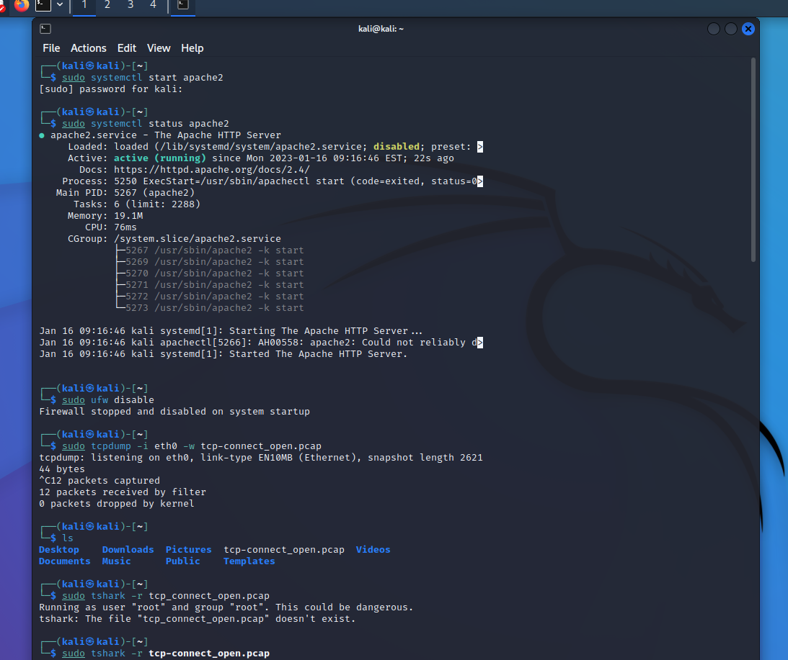

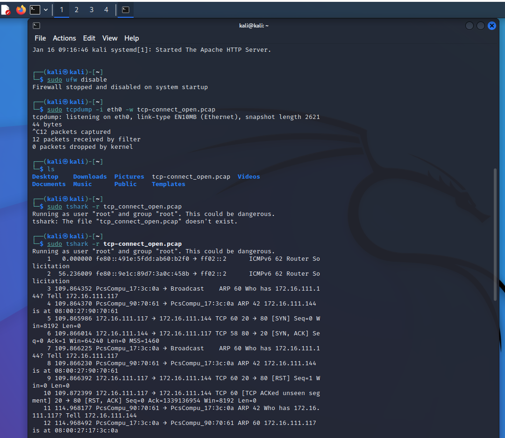

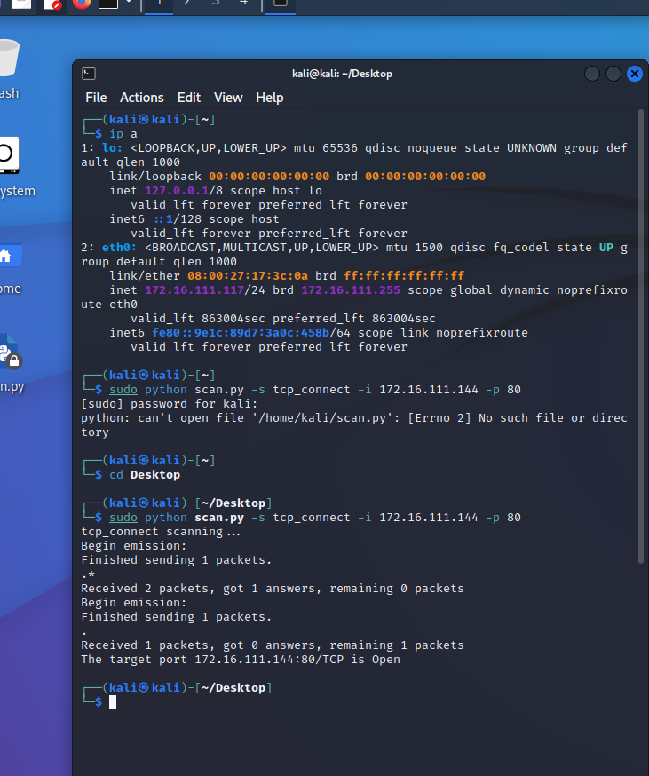

- 关闭

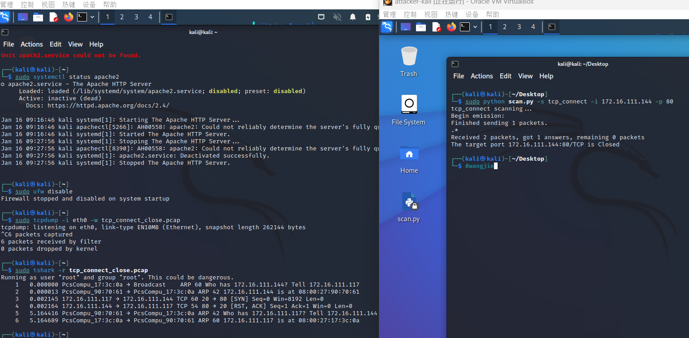

- 过滤

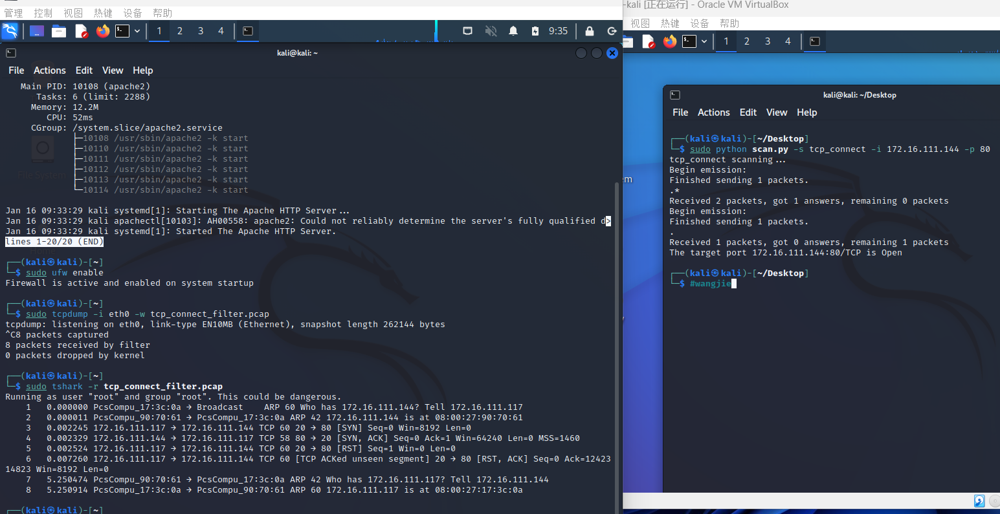

- namp

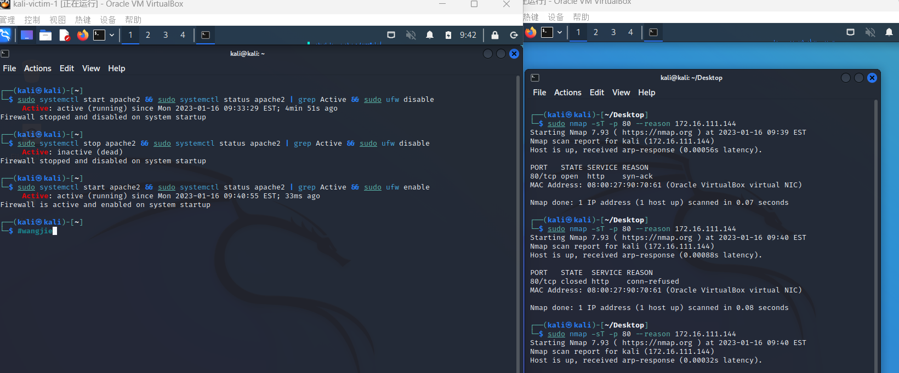

#### TCp stealth scan

- 开放

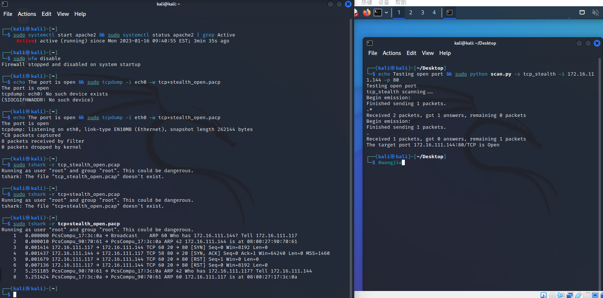

- 关闭

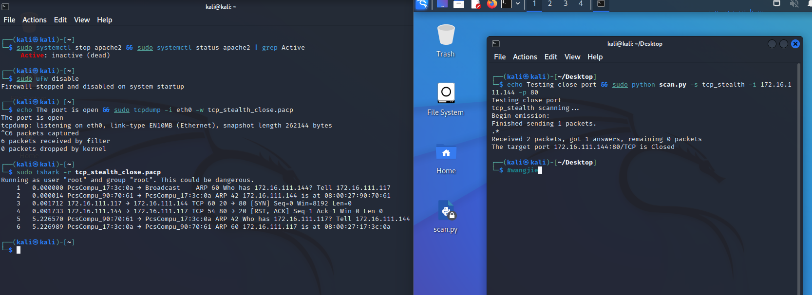

- 过滤

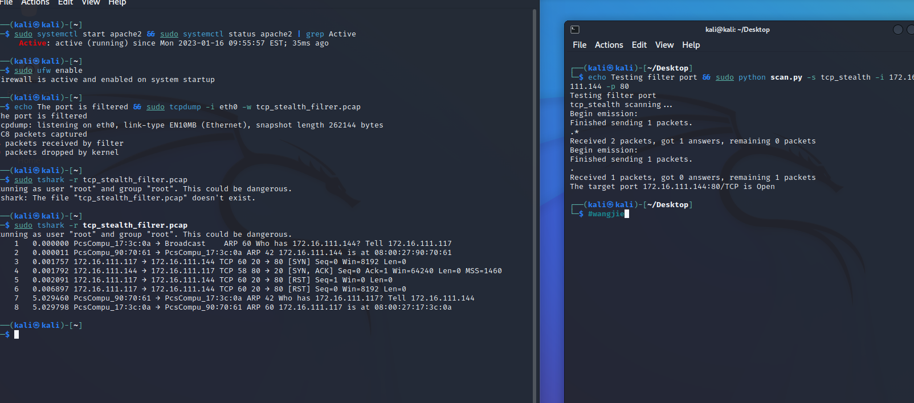

nmpa

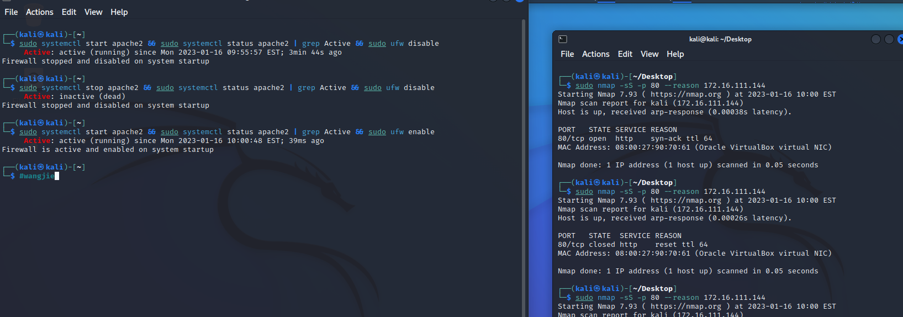

#### TCP Xmas scan

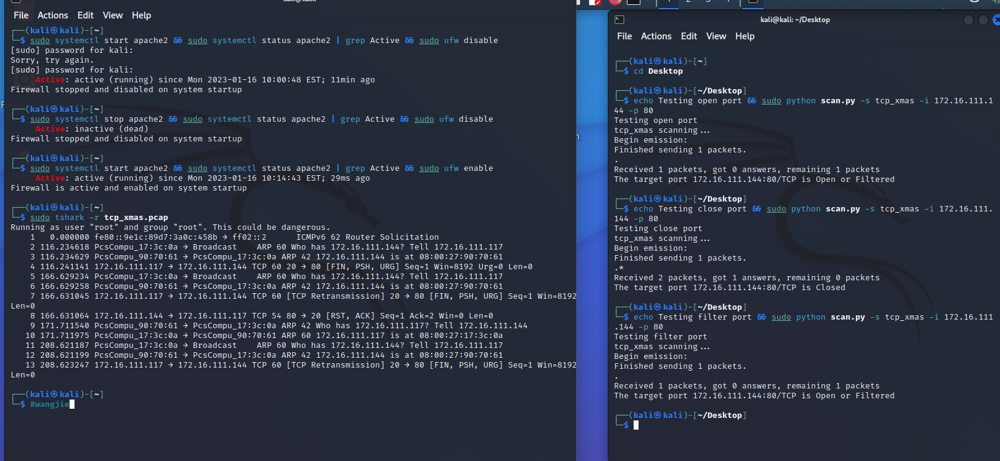

#### TCP fin scan

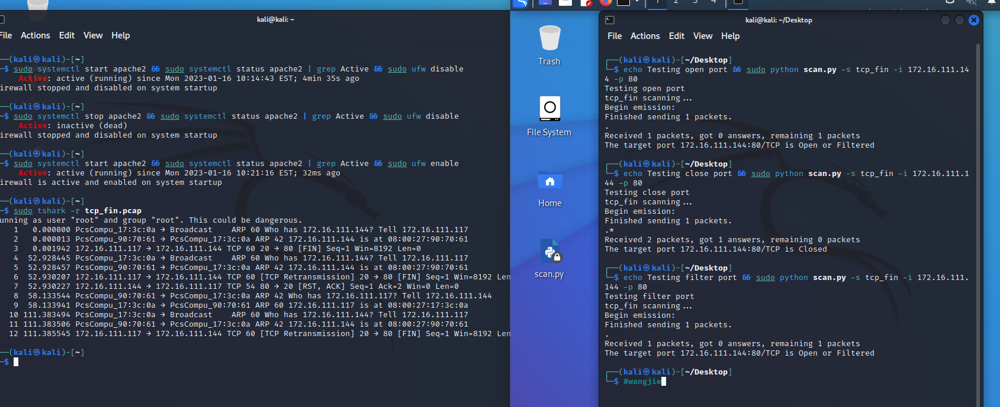

#### TCP null scan

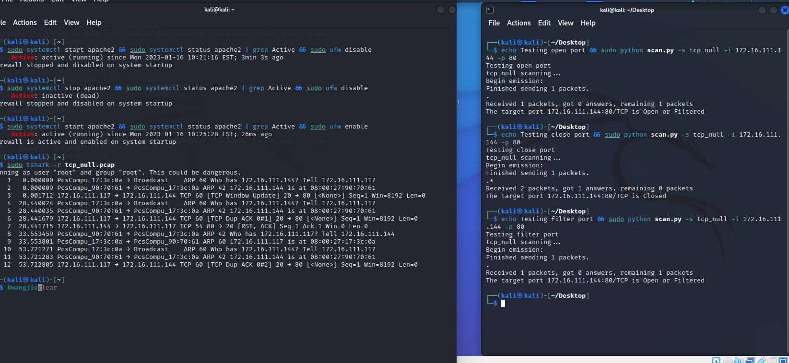